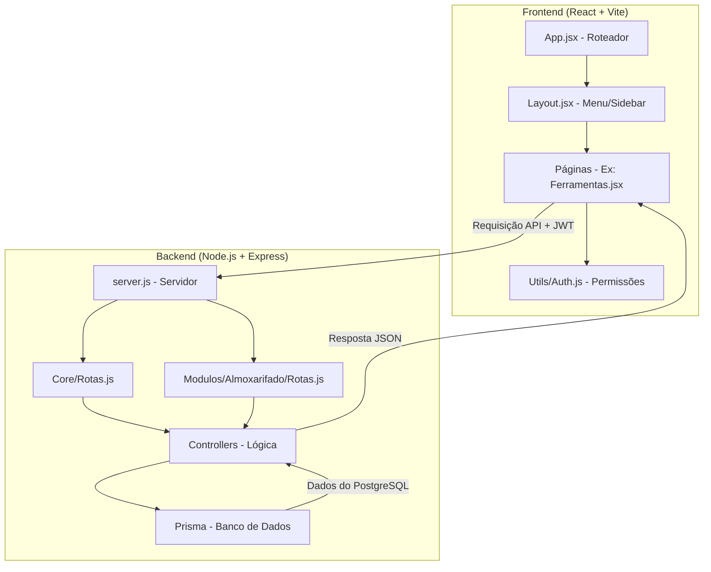
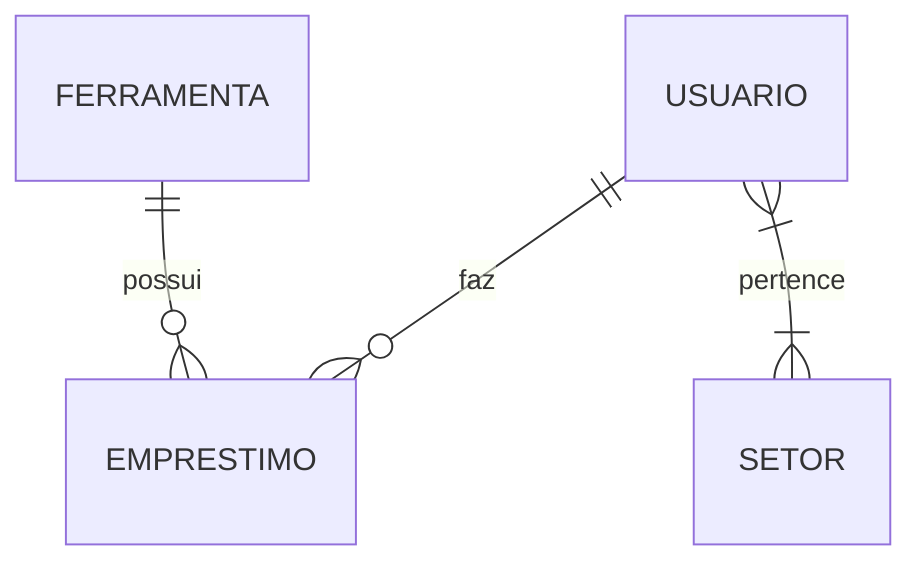

# 🗺️ Guia de Engenharia - Gestão Integrada

Este documento é o seu mapa para entender como o sistema funciona e, principalmente, **como adicionar novas funcionalidades** sem quebrar o que já existe.

---

## 🏗️ 1. Arquitetura do Sistema

O sistema é dividido em duas grandes partes que conversam o tempo todo:



---

## 📂 2. Onde as coisas estão?

### 💻 Frontend (`/frontend/src`)
- **`App.jsx`**: Onde as rotas (URLs) são criadas. Se você criar uma página nova, ela precisa ser registrada aqui.
- **`components/`**: Peças reutilizáveis. Ex: O `Modal.jsx` que usamos para tudo.
- **`pages/`**: Onde ficam as telas reais. Elas são organizadas por setores (ex: `almoxarifado/`).
- **`utils/auth.js`**: O "segurança" do sistema. Define quem pode ver o quê.

### ⚙️ Backend (`/backend/src`)
- **`core/`**: O motor do sistema (Login, Usuários, Conexão com Banco).
- **`modulos/`**: Onde a mágica acontece. Cada setor da prefeitura deve ter sua própria pasta aqui (ex: `almoxarifado/`, `obras/`, `saude/`).

---

## 📊 3. O Banco de Dados (Prisma)

Nosso banco de dados é definido no arquivo `backend/prisma/schema.prisma`. 
Sempre que você precisar de uma nova tabela (ex: "Planilha de Vacinação"), você adiciona lá e roda o comando de sincronização.



---

## 🚀 4. Receita: Como adicionar um Novo Setor?

Se você for em um setor e eles te derem uma planilha para transformar em sistema, siga estes 5 passos:

### Passo 1: Banco de Dados
No `schema.prisma`, crie o modelo da tabela.
```prisma
model NovoSetor {
  id    Int @id @default(autoincrement())
  nome  String
  // adicione os campos da planilha aqui
}
```

### Passo 2: Controlador (Backend)
Crie um arquivo `NovoController.js` na pasta do módulo. Ele terá as funções `criar`, `listar`, `deletar`. Use os outros controllers como modelo!

### Passo 3: Rotas (Backend)
Crie o arquivo `rotas.js` do módulo e ligue ao `server.js`.

### Passo 4: Tela (Frontend)
Crie uma pasta em `frontend/src/pages/novo-setor/` e crie o arquivo `.jsx`. Use o `Ferramentas.jsx` como base para tabelas e modais.

### Passo 5: Registro e Menu
- Adicione a rota no `App.jsx`.
- Adicione o nome do módulo na lista `modulosDisponiveis` dentro do `Layout.jsx`.

---

## 🛠️ 5. Dicas do Desenvolvedor Sênior

1.  **Use o Modal**: Não crie novos modais do zero. Use o `<Modal />` que criamos. Ele já é bonito e responsivo.
2.  **Segurança**: Sempre use a `<RotaProtegida>` no `App.jsx` para garantir que só quem é do setor (ou Admin) entre na página.
3.  **Logs**: Se algo der erro, olhe o terminal do Backend. Procure pelas tags `[ERRO]`.

---

> **Dica Visual:** No VS Code, clique com o botão direito neste arquivo e selecione **"Abrir Visualização (Open Preview)"** para ver os diagramas coloridos!
